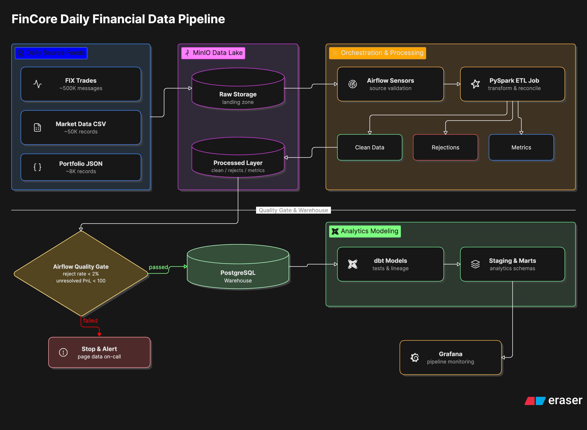
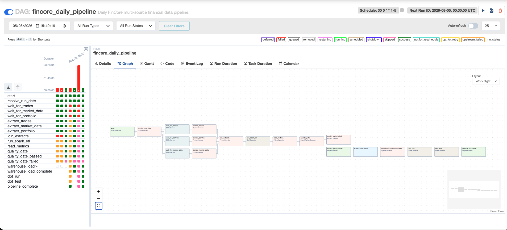
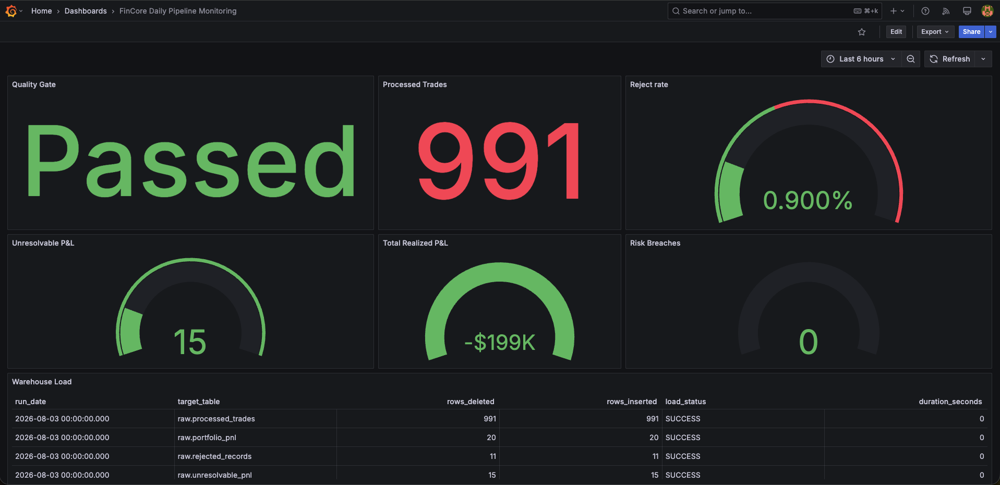

# FinCore Multi-Source Financial Data Pipeline

## Overview

FinCore is an end-to-end financial data engineering pipeline that automates the daily ingestion, validation, transformation, loading, modeling, and monitoring of trade, market, and portfolio data.

The project replaces a fragile manual overnight process with a repeatable and observable pipeline that delivers trusted financial and risk data before the business reporting deadline.

The implementation runs locally using Docker-based open-source services while mapping directly to an AWS production architecture.

---

## Business Problem

FinCore receives three daily financial data feeds:

- Approximately 500,000 FIX trade messages
- Approximately 50,000 market-data CSV records
- Approximately 8,000 portfolio-state JSON records

The original workflow relied on manual processing and had several operational risks:

- Late or missing source files
- Inconsistent schemas
- Malformed FIX messages
- Invalid or missing market prices
- Unresolved foreign-exchange conversions
- Duplicate warehouse loads during reruns
- Limited monitoring and alerting
- Delayed delivery of risk and P&L data

The objective is to build an automated pipeline that:

- Detects source-file availability
- Validates and transforms all three sources
- Separates invalid records from accepted data
- Calculates realized and unrealized P&L
- Blocks warehouse loading when quality thresholds fail
- Supports safe and idempotent reruns
- Builds analytical models
- Provides operational monitoring

---

## Architecture



### Local-to-AWS Service Mapping

| Local Implementation       | AWS Equivalent                         |
| -------------------------- | -------------------------------------- |
| **MinIO**                  | Amazon S3                              |
| **Apache Spark**           | AWS Glue                               |
| **Apache Airflow**         | Amazon MWAA                            |
| **PostgreSQL**             | Amazon Redshift                        |
| **Grafana**                | Amazon CloudWatch Dashboard            |
| **Docker Compose**         | Cloud infrastructure and orchestration |
| Local webhook placeholders | Slack and PagerDuty integrations       |

### Technology Stack

- **Processing & Orchestration:** Python, PySpark, Apache Airflow, pandas, PyArrow, boto3, psycopg2
- **Storage & Infrastructure:** MinIO, PostgreSQL, Docker Compose
- **Modeling & Quality:** dbt Core
- **Observability:** Grafana

---

## Repository Structure

```text
fincore-financial-pipeline/
├── .env.example
├── .gitignore
├── Dockerfile.airflow
├── docker-compose.yml
├── README.md
├── RUNBOOK.md
│
├── airflow/
│   ├── dags/
│   │   └── fincore_daily_pipeline.py
│   ├── logs/
│   └── plugins/
│
├── spark/
│   ├── etl_job.py
│   └── schemas.py
│
├── dbt/
│   ├── dbt_project.yml
│   ├── profiles.yml
│   ├── macros/
│   │   └── generate_schema_name.sql
│   ├── models/
│   │   ├── staging/
│   │   │   ├── sources.yml
│   │   │   ├── schema.yml
│   │   │   ├── stg_processed_trades.sql
│   │   │   ├── stg_portfolio_pnl.sql
│   │   │   └── stg_rejected_records.sql
│   │   └── marts/
│   │       ├── schema.yml
│   │       ├── fct_daily_trading_pnl.sql
│   │       ├── fct_portfolio_risk.sql
│   │       └── fct_daily_data_quality.sql
│   └── tests/
│
├── data-generator/
│   └── generate_sample_data.py
│
├── scripts/
│   ├── init-minio.sh
│   ├── init-warehouse.sql
│   ├── create-warehouse-tables.sql
│   └── create-monitoring-views.sql
│
├── monitoring/
│   └── metrics/
│
└── tests/

```

---

## Source Data Contracts

### 1. FIX Trades

The trade source contains pipe-delimited FIX 4.4 messages. Important tags include:

| FIX Tag | Meaning                      |
| ------- | ---------------------------- |
| **1**   | Portfolio ID                 |
| **6**   | Average cost                 |
| **11**  | Order ID                     |
| **15**  | Currency                     |
| **38**  | Quantity                     |
| **44**  | Trade price                  |
| **54**  | Side (`1` = BUY, `2` = SELL) |
| **55**  | Symbol                       |
| **60**  | Transaction timestamp        |

_Malformed or invalid records are routed directly to the rejected-record output._

### 2. Market Data

Supplied as multiple CSV files containing:

- `symbol`, `asset class`, `close price`, `currency`, `FX rate to USD`, `price date`, `loaded timestamp`

Rows are rejected when:

- The symbol is missing or close price is null/not greater than zero
- The price date does not match the run date
- The currency is invalid or a required FX rate is missing

### 3. Portfolio State

The portfolio source consists of nested JSON payloads containing:

- Portfolio metadata, base currency, positions, average costs, position quantities, and risk limits. The Spark job reads the source using an explicit nested schema.

---

## PySpark Processing

The Spark ETL job executes the following workflow:

1. Reads date-partitioned FIX, market, and portfolio sources.
2. Parses FIX tags into structured columns with tolerant timestamp parsing.
3. Maps trade-side codes to `BUY` and `SELL`.
4. Applies explicit decimal types to prices, quantities, FX rates, and P&L.
5. Validates market prices and currencies.
6. Explodes portfolio positions and risk-limit structures, normalizing instrument symbols.
7. Joins trades and portfolio positions to market prices, converting local values into USD using FX rates.
8. Calculates trade P&L, portfolio market value, and unrealized P&L, separating unresolved records.
9. Writes accepted, rejected, unresolved, and metrics outputs using partition overwrite mode for idempotency.

### Spark Output Layout

```text
fincore-processed/
├── processed/
│   ├── trades/dt=YYYY-MM-DD/
│   ├── portfolio_pnl/dt=YYYY-MM-DD/
│   └── unresolvable_pnl/dt=YYYY-MM-DD/
├── rejected/dt=YYYY-MM-DD/
└── metrics/dt=YYYY-MM-DD/

```

---

## Data-Quality Gate & Airflow DAG

The Spark job publishes metrics to MinIO. Airflow reads these metrics to evaluate the downstream data-quality gate:

- **Trade Reject Rate < 2%** AND **Unresolvable P&L Count < 100**
- **Gate Passed:** Triggers warehouse loads $\rightarrow$ `dbt run` $\rightarrow$ `dbt test`
- **Gate Failed:** Pipeline stops and alerts operations team; rejected branch is skipped.

The trade reject rate is `trade rejections / total inbound trades`. Market-data
and portfolio rejections are reported separately (`rejection_count_by_source`,
`overall_reject_rate`) and are deliberately kept out of the gate numerator, so a
bad market-data feed cannot fail the gate on a trade-quality metric. Airflow
evaluates the thresholds itself rather than trusting the verdict Spark wrote,
and logs any disagreement between the two.

### DAG Specifications

- **Name:** `fincore_daily_pipeline`
- **Schedule:** Weekday schedule with maximum active runs set to 1 and a 6-hour runtime limit.
- **Sensors:** Three parallel S3-compatible sensors (`mode: reschedule`, `poke interval: 10 minutes`, `timeout: 4 hours`).



---

## Warehouse Design

The PostgreSQL data warehouse contains four logical layers: `raw`, `staging`, `marts`, and `audit`.

### Idempotent Loading Strategy

Every warehouse load task:

1. Reads a date-partitioned Parquet dataset from MinIO and initializes an audit tracking record.
2. Deletes existing rows matching the target run date inside a transaction.
3. Loads replacement rows using PostgreSQL `COPY`, tracking inserted/deleted metrics.
4. Commits the transaction (or handles rollbacks independently) to guarantee safe, duplication-free reruns.

---

## dbt Analytics Models

- **Staging Layer (`staging`):** Standardizes names, casing, and source data types (`stg_processed_trades`, `stg_portfolio_pnl`, `stg_rejected_records`).
- **Marts Layer (`marts`):** Aggregates daily trade/P&L summaries, portfolio risk-limit status, and daily rejection metrics (`fct_daily_trading_pnl`, `fct_portfolio_risk`, `fct_daily_data_quality`).
- **Testing:** Automated data testing covers `not_null`, `unique`, `accepted_values`, and source freshness constraints. Custom schema macros write models directly to their designated schemas.

---

## Observability & Monitoring

Grafana serves as the local CloudWatch dashboard equivalent under the name **FinCore Daily Pipeline Monitoring**.

### Key Metrics Tracked

- Quality-gate status & trade reject rate
- Processed trade counts & unresolvable P&L counts
- Realized P&L & portfolio risk breaches
- Warehouse load durations and rejection rules breakdown

> **Note on Business Metrics:** A negative P&L represents a normal market outcome and does not reflect a technical pipeline failure.



---

## Getting Started & Local Execution

### Prerequisites

- Docker & Docker Compose
- Python 3.11+
- PostgreSQL client tools & Git

### Environment Setup

1. Copy the environment template:

```bash
cp .env.example .env

```

2. Generate an Airflow Fernet key:

```bash
python3 -c "import os, base64; print(base64.urlsafe_b64encode(os.urandom(32)).decode())"

```

3. Populate `.env` with required variables and load them into your session:

```bash
set -a
source .env
set +a

```

### Start the Platform

```bash
docker compose build
docker compose up -d
docker compose ps

```

| Service           | Endpoint                |
| ----------------- | ----------------------- |
| **Airflow**       | `http://localhost:8080` |
| **MinIO Console** | `http://localhost:9001` |
| **Spark Master**  | `http://localhost:8081` |
| **Spark Worker**  | `http://localhost:8082` |
| **PostgreSQL**    | `localhost:5433`        |
| **Grafana**       | `http://localhost:3000` |

### Initialize the Warehouse & Generate Data

On a **fresh** warehouse volume the schemas, tables, and monitoring views are
created automatically by the Postgres entrypoint, in this order:

| Order | Script                                | Creates            |
| ----- | ------------------------------------- | ------------------ |
| 01    | `scripts/init-warehouse.sql`          | Schemas            |
| 02    | `scripts/create-warehouse-tables.sql` | Tables and indexes |
| 03    | `scripts/create-monitoring-views.sql` | Monitoring views   |

To re-apply them against an **existing** volume (both are idempotent —
`CREATE TABLE IF NOT EXISTS` / `CREATE OR REPLACE VIEW`):

```bash
# Create warehouse tables
docker compose exec -T warehouse-db psql -U "$WAREHOUSE_USER" -d "$WAREHOUSE_DB" < scripts/create-warehouse-tables.sql

# Create monitoring views
docker compose exec -T warehouse-db psql -U "$WAREHOUSE_USER" -d "$WAREHOUSE_DB" < scripts/create-monitoring-views.sql

# Generate sample dataset for a specific date
python3 data-generator/generate_sample_data.py --run-date 2026-08-03

```

### Upload Sample Data to MinIO & Run Spark

```bash
# Create buckets and upload one run-date partition (idempotent)
docker compose run --rm \
  -v "$PWD/scripts:/scripts:ro" \
  -v "$PWD/data/generated:/data-import:ro" \
  --entrypoint /bin/sh minio-init /scripts/init-minio.sh 2026-08-03

# Run Spark ETL job manually
docker compose exec spark-master /bin/bash -lc '
  /opt/spark/bin/spark-submit \
    --master spark://spark-master:7077 \
    --conf spark.jars.ivy=/tmp/.ivy2 \
    --packages org.apache.hadoop:hadoop-aws:3.4.2 \
    /opt/fincore/spark/etl_job.py \
    --run-date 2026-08-03 \
    --s3-endpoint http://minio:9000 \
    --s3-access-key "$MINIO_ROOT_USER" \
    --s3-secret-key "$MINIO_ROOT_PASSWORD"
'

```

### Trigger Airflow & Execute dbt Models

```bash
# Trigger pipeline execution
docker compose exec airflow-webserver airflow dags trigger fincore_daily_pipeline --conf '{"run_date": "2026-08-03"}'

# Run dbt checks and transformations
docker compose exec airflow-scheduler bash -lc '
  cd /opt/airflow/dbt
  dbt debug --profiles-dir .
  dbt run --profiles-dir .
  dbt test --profiles-dir .
'

```

---

## Operational Documentation & Security

- Detailed recovery workflows, troubleshooting procedures, and incident responses are outlined in [RUNBOOK.md](RUNBOOK.md).
- Never check `.env` files or hard-code credentials into version control. Use Airflow connections, variables, or a dedicated secrets manager in production environments.
